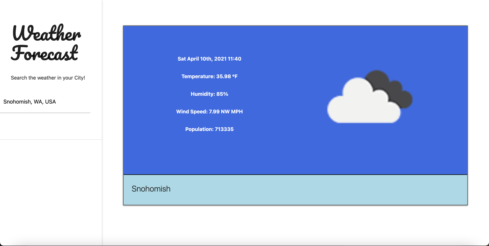
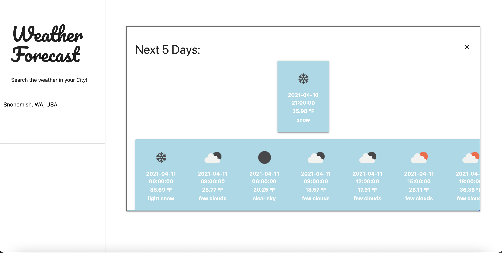

# Forecast-Dashboard
Connects to Weather API to present user with a city's 5-day Forecast

-----Deployment----- 
Presented is placeholder information 

The user will have access to a sidenav on any device 
In the sidenav the user is presented with the title of the Web App plus a short sentence of what it does 
Under the title there's is a searchbox, that also uses a Google Maps/Places API that will autocomplete/suggest the city the user is trying to lookup 
Upon clicking on the city you want to search, in the main section, the placeholder City Name is changed to the city searched. 
Above the City Name, the user will be presented with: the date; current weather icon, temperature in degrees Fahrenheit, and a short description; humidity; wind speed and direction; and the population of the city.  

The User can click on the information which will transform the card presentation to the information hidden 

This information hidden contain the weather of the city for the next five days in time intervals of 3 hrs seperating each.  

When the user searches for another city, the previous information is cleared and the new information is presented  

APIs in Use: Google Maps API, Google Places API, OpenWeather API

GITHUB URL: https://github.com/Anthony2428/Forecast-Dashboard  